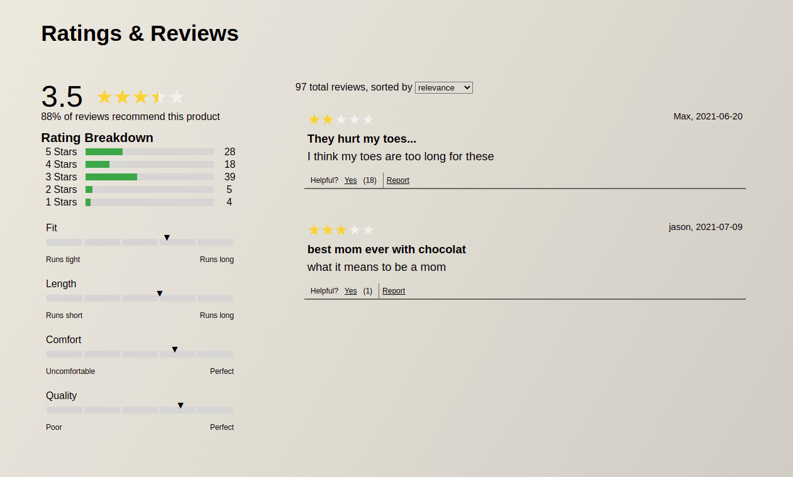

# Cavatappi Catwalk

## Table of Contents

- [Description](#description)
- [Getting Started](#getting-started)
- [Installation](#installation)
- [Usage](#usage)
  - [Overview](#overview)
  - [Ratings And Reviews](#ratings-and-reviews)
  - [Questions And Answers](#questions-and-answers)
- [Authors](#authors)

---

## Description

Delivering a fully functional front end that meets the specifications and requirements outlined by the project outline. Must interact with already established API and manipulate and shape data as necessary to achieve the desired look.

---

## Getting Started

- Clone the repo
  ```
  git clone https://github.com/Cavatappi-Engineering-Solutions/project-catwalk.git
  ```
- Enter your API KEY in config.js
  ```
  const API_KEY = 'ENTER YOUR API'
  ```

---

## Installation

- Install NPM packages
  ```
  npm install
  ```
- Start the local server
  ```
  npm run start
  ```
- Start webpack transpiling
  ```
  npm run build
  ```
- Start SASS transpiling
  ```
  npm run sass
  ```

---

## Usage

### Overview


### Ratings And Reviews



- Displays the metadata breakdown for the product based on all reviews recorded to date
- Breaks down average reviewer opinions on designated characteristics
- Displays review window with individual review cards sorted by predefined choices
- Allows users to mark individual reviews as helpful or report if inappropriate

### Questions And Answers

---

## Authors

- [Andrew Huang](https://github.com/AndrewHuang123)
- [Timothy Parrish](https://github.com/timapar)
- [MarcAnthony Petrecca](https://github.com/marcpetrecca1)
